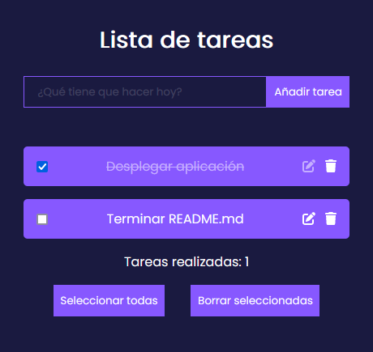

<div align="justify">

# Lista de tareas con persistencia de datos

<div align="center">
 
</div>
 
## Despliegue en desarrollo
Para probar y desplegar la aplicación en local, debemos seguir tres sencillos pasos:

1. Clonación de repositorio
```console
git clone git@github.com:samugd17/todo_list.git

cd todo_list
```
2. Instalación de paquetes necesarios
```console
npm install
```
3. Lanzamiento de la app en localhost:3000
```console
npm start
```

## Acceso a aplicación desplegada
La aplicación se encuentra desplegada a través de [Vercel](https://vercel.com/) y puede ser visitada a través de [este enlace](https://todo-list-lac-nu.vercel.app/).

</div>
